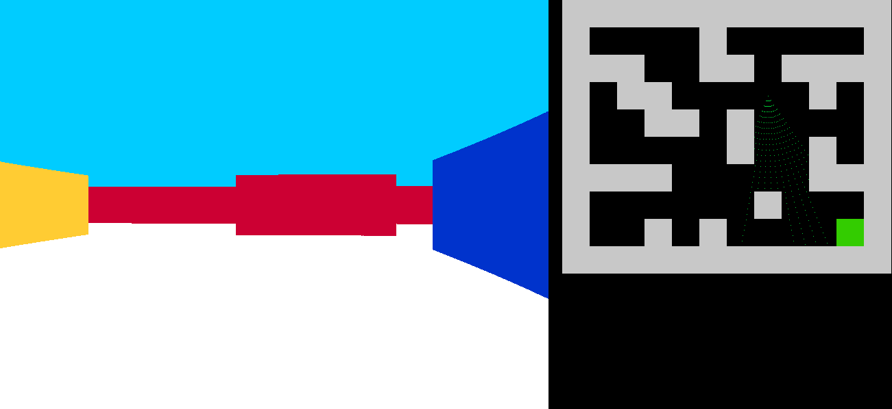

# Mini_Wolfestein_3d
Classic programming school project : ray casting mini game.

This program is a classic 42/epitech project. The goal is to create a small labyrinth in wich we can walk using the ray casting method.

The ray casting method consists in creating a two dimensional space (the "map"), in which we define the position of the user and walls.
From this, we cast rays that will travel on the two dimensional plan, and will calculate the distance between the user and the walls.
This allows us to draw walls of different sizes on each column of the screen, giving the impression of a 3d space.

The hardest part of this project was to give different colors to walls depending on their orientation, for which i used a modulo method based on the angle of the user's view, and the defined distance separing two cases on my map.

